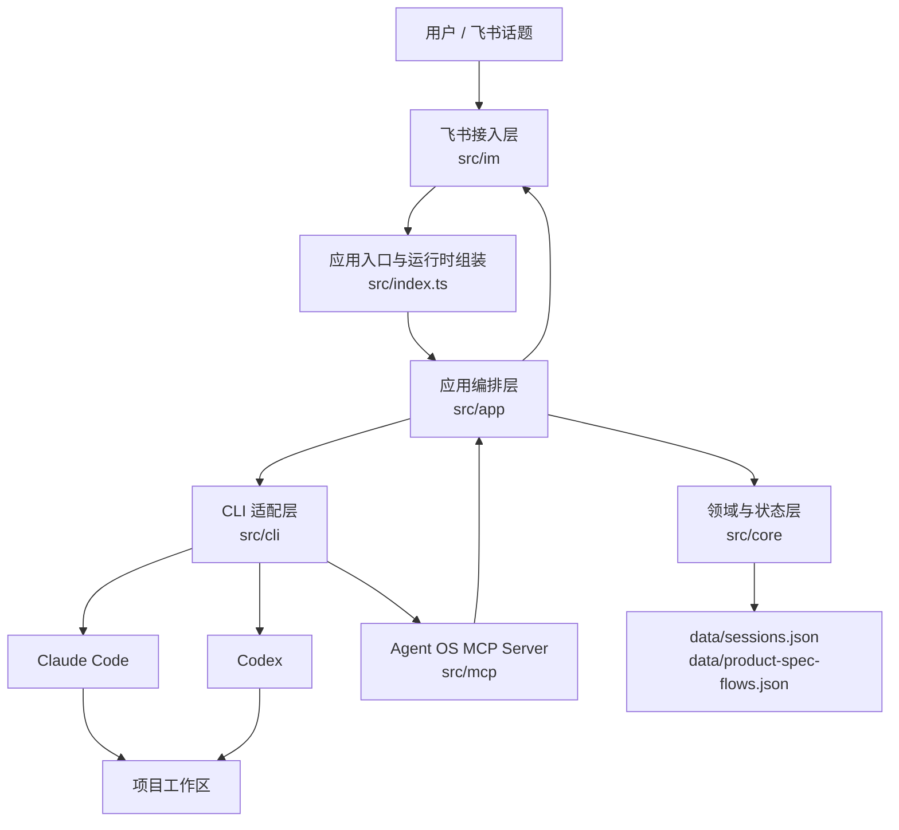
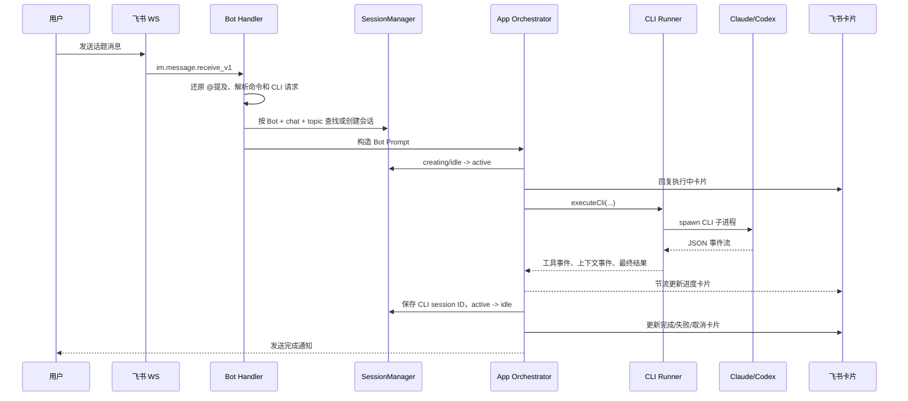
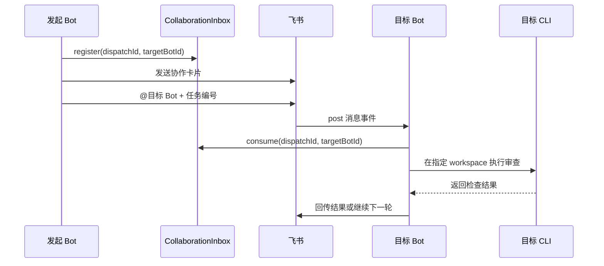
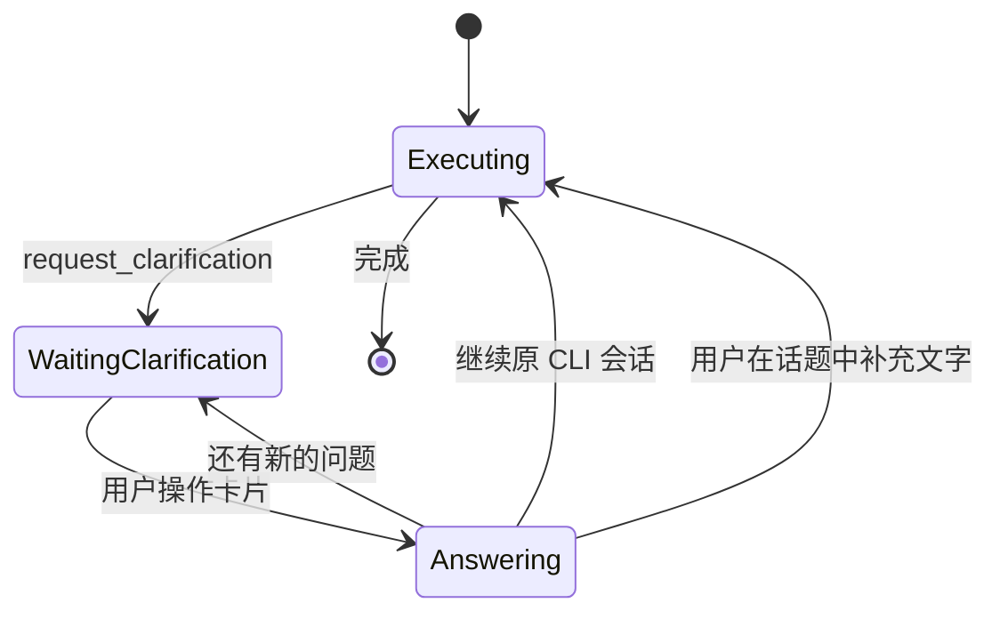
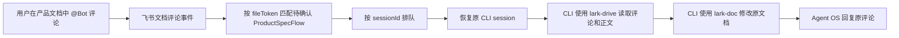

# Agent OS 项目架构

## 1. 项目定位

Agent OS 是一个以飞书为交互界面、以 Claude Code 和 Codex 为执行引擎的多 Agent 协作运行时。

项目的核心目标不是实现一个新的大模型，而是把以下能力组合成一个可持续运行的个人生产系统：

- 在飞书话题中接收任务、命令、卡片操作和文档评论。
- 为不同角色配置独立的 Bot、工作目录、默认 CLI 和项目 Skill。
- 将一个飞书话题映射为一个长期 CLI 会话。
- 统一驱动 Claude Code 与 Codex，并将它们的事件转换为统一进度。
- 通过飞书卡片承载任务状态、澄清问题、产品方案确认和会话恢复。
- 让多个长期存在的飞书 Bot 通过消息卡片互相交接任务。
- 通过 MCP 工具把“向用户提问”和“提交产品方案”回传给 Agent OS。

当前实现是一个单进程、事件驱动的 TypeScript 服务。

## 2. 总体架构



### 2.1 分层职责

| 层 | 主要目录 | 主要职责 |
| --- | --- | --- |
| 接入层 | `src/im` | 接收飞书事件，解析消息、提及、资源和卡片操作；封装回复、卡片更新、资源下载、文档评论操作 |
| 应用编排层 | `src/app` | 编排一次任务的完整生命周期；连接会话、CLI、进度、卡片、澄清、产品方案和通知 |
| 领域与状态层 | `src/core` | 定义会话、团队、协作、澄清、产品方案和任务进度等领域模型与状态规则 |
| CLI 适配层 | `src/cli` | 统一 Claude Code 与 Codex 的启动、恢复、事件解析、会话列表和上下文整理能力 |
| MCP 工具层 | `src/mcp` | 向 CLI 暴露 Agent OS 专属工具，让 CLI 能触发澄清流程和产品方案确认流程 |
| 配置与工作区 | `config`、`src/workspace-template` | 配置 Bot、团队角色、工作目录和 Skill 模板 |
| 持久化 | `src/core/*-store.ts` | 通过 JSON 文件保存会话和产品方案确认状态 |

## 3. 启动与运行时组装

入口文件是 [`src/index.ts`](/Users/wangdekang/Desktop/kkdw_github_link_project/AI_agent_os_kkdw/src/index.ts)。

启动过程大致如下：

1. 加载 `.env`。
2. 读取 `config/bots.json`，如果通过 `BOTS_CONFIG` 指定，则读取指定路径。
3. 使用 `zod` 校验 Bot 配置、团队 Leader、Skill、CLI 和工作目录。
4. 检查每个 Bot 的默认工作目录和 Skill 是否存在。
5. 初始化：
   - `TeamRegistry`
   - `SessionManager`
   - `JsonSessionStore`
   - `CollaborationInbox`
   - `ClarificationFlowStore`
   - `JsonProductSpecFlowStore`
   - `activeRuns`
   - `contextWindows`
6. 为每个启用的 Bot 建立独立飞书长连接。
7. 获取 Bot 身份，并将 Bot 注册到 `botRuntimes`。
8. 如果 Bot 具备 `lark-drive` Skill，则订阅飞书文档评论事件。

运行时通过 [`src/app/runtime.ts`](/Users/wangdekang/Desktop/kkdw_github_link_project/AI_agent_os_kkdw/src/app/runtime.ts) 暴露给应用层：

```ts
interface AppRuntime {
  sessions: SessionManager;
  teamRegistry: TeamRegistry;
  activeRuns: Map<string, ActiveRun>;
  contextWindows: Map<string, number>;
  botRuntimes: Map<string, BotRuntime>;
  processedCollaborationTurns: Set<string>;
  collaborationInbox: CollaborationInbox;
  clarificationFlows: ClarificationFlowStore;
  productSpecFlows: ProductSpecFlowStore;
}
```

它相当于当前进程内的应用服务容器和共享运行时状态。

## 4. 一次普通任务的请求链路



### 4.1 消息入口

[`src/im/lark.ts`](/Users/wangdekang/Desktop/kkdw_github_link_project/AI_agent_os_kkdw/src/im/lark.ts) 使用飞书 Node SDK：

- `WSClient` 接收实时事件。
- `EventDispatcher` 分发消息、卡片操作和文档评论事件。
- `Bot` 接口屏蔽飞书 REST API 细节。
- `reply`、`replyCard`、`updateCard` 统一文本和交互卡片输出。
- `downloadResource` 将飞书图片和文件下载到 `data/downloads`。
- `subscribeToDocumentComments` 订阅文档评论事件。
- `replyToDocumentComment` 和 `setDocumentCommentWorking` 处理文档评论反馈。

[`src/im/message-parser.ts`](/Users/wangdekang/Desktop/kkdw_github_link_project/AI_agent_os_kkdw/src/im/message-parser.ts) 负责：

- 将飞书内部的 `@_user_N` 占位符还原为可读的 `@显示名`。
- 从文本、图片、文件和富文本消息中提取资源 Key。

### 4.2 会话解析

[`src/core/session-manager.ts`](/Users/wangdekang/Desktop/kkdw_github_link_project/AI_agent_os_kkdw/src/core/session-manager.ts) 将飞书话题映射为 Agent OS 会话：

```text
Session Key = botId + chatId + topicId
topicId = threadId || rootId || messageId
```

一个 `Session` 记录：

- Agent OS 会话 ID。
- 所属 Bot。
- 飞书聊天和话题。
- 使用的 CLI：`claude` 或 `codex`。
- CLI 原生会话 ID。
- 当前工作目录。
- 会话状态和时间戳。

会话状态：

```text
creating -> active -> idle -> active -> idle
creating -> idle
creating/active/idle -> closed
```

会话的关键约束：

- 同一个飞书话题不能同时执行多个任务。
- 已关闭的话题不能继续执行任务。
- 切换 CLI 只能在新话题中完成。
- 使用 `/cd` 切换工作目录时，会清除旧 CLI 会话 ID，避免跨项目复用上下文。
- 进程重启后，`creating` 和 `active` 会恢复为 `idle`，避免永久卡死。

### 4.3 Prompt 组装

[`src/core/bot-registry.ts`](/Users/wangdekang/Desktop/kkdw_github_link_project/AI_agent_os_kkdw/src/core/bot-registry.ts) 中的 `buildBotPrompt` 将以下内容拼接成最终 Prompt：

1. Bot 角色。
2. Bot 自定义系统提示。
3. 团队成员上下文。
4. 产品方案交付规则。
5. 项目 Skill 加载规则。
6. 飞书输出规则。
7. 当前任务。

Skill 的加载优先级通过 Prompt 明确约束：

```text
当前工作区 .agents/skills/<skill>/SKILL.md
    ↓ 不存在
当前工作区 .claude/skills/<skill>/SKILL.md
    ↓ 不存在
用户级或全局 Skill
```

这里的团队成员是长期存在的飞书 Bot；CLI 内部的子 Agent 只适合处理临时分工，不能冒充团队成员。

## 5. CLI 执行架构

### 5.1 适配器接口

[`src/cli/types.ts`](/Users/wangdekang/Desktop/kkdw_github_link_project/AI_agent_os_kkdw/src/cli/types.ts) 定义统一的 `CliAdapter`：

```ts
interface CliAdapter {
  id: "claude" | "codex";
  command: string;
  displayName: string;
  buildArgs(prompt: string): string[];
  buildResumeArgs(prompt: string, sessionId: string): string[];
  buildCompactPlan(sessionId: string, instructions?: string): CliCompactPlan;
  parseEvents(line: string): CliEvent[];
}
```

当前有两个实现：

- [`src/cli/claude-adapter.ts`](/Users/wangdekang/Desktop/kkdw_github_link_project/AI_agent_os_kkdw/src/cli/claude-adapter.ts)
- [`src/cli/codex-adapter.ts`](/Users/wangdekang/Desktop/kkdw_github_link_project/AI_agent_os_kkdw/src/cli/codex-adapter.ts)

### 5.2 统一事件模型

Claude Code 和 Codex 的输出协议不同，但最终都转换为以下事件：

- `session`：发现或创建 CLI 会话。
- `tool_start`：工具开始执行。
- `tool_end`：工具执行结束。
- `tool_call`：发现 Agent OS 关注的特殊工具调用。
- `context`：上下文 Token 使用量变化。
- `result`：最终回答和统计数据。
- `error`：执行失败。

这样应用层不需要理解 Claude 或 Codex 的原始 JSON 结构，只处理统一的任务事件。

### 5.3 子进程运行器

[`src/cli/runner.ts`](/Users/wangdekang/Desktop/kkdw_github_link_project/AI_agent_os_kkdw/src/cli/runner.ts) 负责：

- 使用 `child_process.spawn` 启动 CLI。
- 通过 stdout 按行读取 JSON 事件。
- 将事件交给适配器解析。
- 收集 CLI session ID、最终回答、统计数据和特殊工具调用。
- 将 stderr 转换为错误信息。
- 支持超时和 `AbortSignal` 取消。

默认单次执行超时时间为 10 分钟。

### 5.4 上下文整理和历史会话

上下文整理由 [`src/cli/native-compact.ts`](/Users/wangdekang/Desktop/kkdw_github_link_project/AI_agent_os_kkdw/src/cli/native-compact.ts) 处理：

- Claude 使用 stream-json 协议发起原生 `/compact`。
- Codex 使用 `app-server --stdio`，通过 `thread/compact/start` 发起整理。

历史会话由 [`src/cli/native-sessions.ts`](/Users/wangdekang/Desktop/kkdw_github_link_project/AI_agent_os_kkdw/src/cli/native-sessions.ts) 读取：

- Claude 从用户级配置目录下的项目 JSONL 会话中筛选工作目录。
- Codex 通过 app-server 的 `thread/list` 获取会话。

## 6. 任务进度与飞书卡片

应用编排层通过 [`src/core/task-progress.ts`](/Users/wangdekang/Desktop/kkdw_github_link_project/AI_agent_os_kkdw/src/core/task-progress.ts) 维护任务进度：

- 当前工具。
- 工具调用总数。
- 已完成工具数。
- 最近活动。
- 当前耗时。
- 当前上下文 Token。
- 上下文窗口大小。

[`src/im/card.ts`](/Users/wangdekang/Desktop/kkdw_github_link_project/AI_agent_os_kkdw/src/im/card.ts) 将进度转换成飞书交互卡片。

卡片状态包括：

- `running`：执行中，允许任务发起人点击停止。
- `success`：执行完成，展示摘要、耗时、工具调用和 Token 信息。
- `failed`：执行失败，折叠展示技术错误。
- `cancelled`：任务被用户停止或因关闭会话而取消。

进度卡片使用 `ThrottledCardUpdater` 节流更新，避免 CLI 高频事件直接造成飞书 API 压力。

## 7. Agent 协作架构

### 7.1 配置驱动的长期团队

Bot 配置位于 `config/bots.json`，示例见 [`config/bots.example.json`](/Users/wangdekang/Desktop/kkdw_github_link_project/AI_agent_os_kkdw/config/bots.example.json)。

每个 Bot 可以配置：

- `id`
- 飞书 App 凭证对应的环境变量名
- 默认 CLI
- 角色
- Skill 列表
- 系统提示
- 默认工作目录
- `reviewBy`
- 最大协作轮数

`teamLeader` 指定团队 Leader。`TeamRegistry` 负责：

- 按 ID 查找 Bot。
- 构造团队上下文。
- 校验 `reviewBy` 指向的成员。
- 检查 Skill 文件是否存在。

### 7.2 消息驱动的 Bot 间交接

协作不是在单个 CLI 进程内完成，而是通过飞书 Bot 之间的消息完成。



协作消息包含：

- `dispatchId`：当前投递编号。
- `taskId`：整项协作任务编号。
- `fromBotId` 和 `toBotId`。
- `round` 和 `maxRounds`。
- `workspaceDir`。
- 交接 Prompt。

`CollaborationInbox` 在消息到达时核对目标 Bot 并立即消费，`processedCollaborationTurns` 防止重复处理同一轮协作。

### 7.3 默认审查链路

当一个普通任务完成后：

1. 如果当前 Bot 配置了 `reviewBy`，则自动向审查 Bot 发起协作。
2. 审查 Bot 在相同工作目录中读取刚完成的实现。
3. 如果还有协作轮数，则审查结果回传给原 Bot。
4. 达到最大轮数后，将最终结果通知原 Bot。

具有 `grill-me` Skill 的产品澄清流程不会自动进入后续团队编排，而是停留在产品结论和确认阶段。

## 8. MCP 反向控制面

CLI 执行过程中，Agent OS 通过 MCP 向 Claude Code 和 Codex 注入两个工具：

```text
request_clarification
request_spec_approval
```

对应实现：

- [`src/mcp/app-tools-server.ts`](/Users/wangdekang/Desktop/kkdw_github_link_project/AI_agent_os_kkdw/src/mcp/app-tools-server.ts)
- [`src/cli/app-tools.ts`](/Users/wangdekang/Desktop/kkdw_github_link_project/AI_agent_os_kkdw/src/cli/app-tools.ts)

MCP Server 通过 stdio 启动。Claude 使用 `--mcp-config` 注入配置，Codex 使用 `-c mcp_servers.agent_os.*` 注入配置。

### 8.1 需求澄清流程



实现链路：

1. CLI 通过 MCP 调用 `request_clarification`。
2. 适配器将 MCP 工具调用转换为 `tool_call`。
3. `index.ts` 从工具调用历史中提取并校验请求。
4. 创建 `ClarificationFlow`，会话从 `active` 回到 `idle`。
5. 发送澄清卡片，限制只有任务发起人可以回答。
6. 用户逐题选择、输入自定义答案或采用推荐项。
7. `card-action-handler.ts` 恢复原会话并异步调用 `continueClarificationFlow`。
8. 继续执行后可能再次澄清，也可能进入产品方案确认或直接完成。

澄清流程主要由以下模块组成：

- `src/core/clarification.ts`
- `src/app/clarification-runner.ts`
- `src/app/card-action-handler.ts`
- `src/im/card.ts`

### 8.2 产品方案确认流程

产品 Bot 或具备相关 Skill 的 Bot 通过 MCP 调用 `request_spec_approval`。

支持两种交付方式：

```text
deliveryMode = local
  specPath
  ticketsPath

deliveryMode = lark-doc
  documentUrl
```

应用层会：

1. 校验工具参数。
2. 对本地模式检查产品说明文件和 Tickets 目录是否真实存在。
3. 创建 `ProductSpecFlow`。
4. 将会话恢复为 `idle`。
5. 展示产品方案确认卡。
6. 仅允许任务发起人点击确认。
7. 将确认状态保存到 `data/product-spec-flows.json`。

实现链路：

- `src/core/product-spec.ts`
- `src/core/product-spec-store.ts`
- `src/app/product-spec-documents.ts`
- `src/app/card-action-handler.ts`
- `src/app/product-spec-submission.ts`

## 9. 飞书文档评论闭环

当 Bot 配置了 `lark-drive` Skill 时，启动阶段会订阅 `drive.notice.comment_add_v1`。



相关设计：

- 只有明确提及 Bot 的评论才会处理。
- 只有处于 `pending` 或 `approved` 状态、且文档 Token 匹配的产品方案才会处理。
- 同一 CLI 会话的评论按顺序排队。
- 使用事件 ID、评论 ID 和回复 ID 去重。
- 执行期间添加 `Typing` 反应，结束后移除。
- 评论处理复用原产品 CLI 会话，因此可以继续使用原有上下文。

实现模块：

- `src/app/product-comment-runner.ts`
- `src/core/product-spec.ts`
- `src/index.ts`
- `src/im/lark.ts`

## 10. 持久化与状态管理

### 10.1 已持久化状态

会话保存到 `data/sessions.json`：

- Agent OS 会话 ID。
- Bot、聊天、话题关联。
- CLI 类型和 CLI session ID。
- 工作目录。
- 会话状态。
- 创建和更新时间。

产品方案流程保存到 `data/product-spec-flows.json`：

- 产品方案 Token。
- 任务和会话关联。
- 发起人身份。
- 交付方式和产物地址。
- `pending`、`approved`、`expired` 状态。

写入采用临时文件加原子重命名：

```text
write *.tmp -> rename *.tmp -> target.json
```

### 10.2 仅保存在内存中的状态

以下状态没有独立持久化：

- 当前运行中的 `AbortController`。
- 当前 CLI 上下文窗口缓存。
- Bot 运行时身份。
- 协作收件箱。
- 已处理的协作轮次。
- 澄清流程。
- 文档评论去重集合。
- 文档评论队列。

因此，进程重启后：

- 执行中的 CLI 任务会丢失，但普通会话会被恢复为空闲。
- 未完成的澄清流程不会恢复。
- 协作中尚未消费的消息不会恢复。
- 文档评论去重和排队状态会丢失。
- 产品方案流程可以从 JSON 文件恢复。

## 11. 命令与用户操作模型

消息解析支持以下命令：

```text
/help
/status
/team
/new
/resume
/compact [要求]
/cd
/cd <目录>
/close
/claude <任务>
/codex <任务>
```

命令处理集中在 [`src/app/command-handler.ts`](/Users/wangdekang/Desktop/kkdw_github_link_project/AI_agent_os_kkdw/src/app/command-handler.ts)：

- `/new` 清除当前话题绑定的 CLI session ID。
- `/resume` 读取当前工作目录下的原生 CLI 会话并通过卡片选择。
- `/compact` 调用当前 CLI 的原生上下文整理能力。
- `/cd` 切换工作目录并清除旧 CLI 会话。
- `/close` 取消当前任务并关闭会话。
- `/team` 展示团队成员、角色、CLI、Skill 和连接状态。

卡片操作集中在 [`src/app/card-action-handler.ts`](/Users/wangdekang/Desktop/kkdw_github_link_project/AI_agent_os_kkdw/src/app/card-action-handler.ts)：

- 停止任务。
- 回答澄清问题。
- 确认产品方案。
- 恢复历史 CLI 会话。

## 12. 配置与部署模型

### 12.1 运行环境

项目使用：

- Node.js `>= 22`
- ESM
- TypeScript
- pnpm
- `tsx` 开发和启动
- `zod` 配置与领域数据校验
- `@larksuiteoapi/node-sdk` 飞书接入
- `@modelcontextprotocol/sdk` MCP Server

常用命令：

```bash
pnpm start       # watch 模式启动
pnpm start:once  # 单次启动
pnpm build       # TypeScript 构建
```

### 12.2 凭证

Bot 配置只保存环境变量名，不保存真实凭证：

```json
{
  "appIdEnv": "FEISHU_PRODUCT_APP_ID",
  "appSecretEnv": "FEISHU_PRODUCT_APP_SECRET"
}
```

真实 App ID 和 App Secret 通过 `.env` 注入。

### 12.3 工作目录隔离

每个 Bot 有默认工作目录，每个飞书话题拥有独立的当前工作目录。

CLI 执行时的 `cwd` 来自会话，而不是全局进程目录。这样可以让：

- 产品 Bot 和开发 Bot 共享项目目录，但保持角色和会话隔离。
- 不同话题切换到不同项目。
- 协作 Bot 在发起方指定的工作目录中审查代码。

## 13. 目录结构说明

```text
src/
├── index.ts                    # 进程入口、Bot 启动、主事件编排
├── im/                         # 飞书协议和消息/卡片
│   ├── lark.ts
│   ├── card.ts
│   └── message-parser.ts
├── app/                        # 应用服务和流程编排
│   ├── cli-execution.ts
│   ├── command-handler.ts
│   ├── card-action-handler.ts
│   ├── clarification-runner.ts
│   ├── product-comment-runner.ts
│   └── notification-service.ts
├── core/                       # 领域模型、状态机、配置和持久化
│   ├── session-manager.ts
│   ├── session-store.ts
│   ├── bot-registry.ts
│   ├── team-registry.ts
│   ├── collaboration.ts
│   ├── clarification.ts
│   ├── product-spec.ts
│   └── task-progress.ts
├── cli/                        # Claude/Codex 适配和子进程协议
│   ├── runner.ts
│   ├── claude-adapter.ts
│   ├── codex-adapter.ts
│   ├── native-compact.ts
│   └── native-sessions.ts
└── mcp/                        # Agent OS MCP 工具 Server
    └── app-tools-server.ts
```

## 14. 当前架构的优点

### 14.1 外部平台和执行引擎已隔离

飞书细节主要集中在 `src/im`，Claude/Codex 协议差异主要集中在 `src/cli`。应用编排层使用抽象的 `Bot`、`CliAdapter` 和 `CliEvent`，便于替换平台或增加新的 CLI。

### 14.2 会话与工作目录绑定清晰

Session 同时记录飞书话题、Bot、CLI 和工作目录，避免把“用户看到的话题”与“CLI 的原生会话”混为一谈。

### 14.3 人机协作流程具备显式状态

澄清流程和产品方案流程不是依赖自然语言猜测，而是通过结构化工具调用、Zod 校验、Token、发起人校验和状态转换完成。

### 14.4 对长任务有良好的可观察性

CLI 事件会转换成工具级进度、上下文使用量、耗时和最终状态，并通过可更新卡片反馈给用户。

### 14.5 协作采用真实 Bot 身份

团队成员是长期存在的飞书 Bot，不把 CLI 内部的临时子 Agent 伪装成团队成员，职责边界比较明确。

## 15. 当前架构的限制与风险

### 15.1 单进程内存状态限制了水平扩展

协作收件箱、澄清流程、运行中任务、评论队列和去重集合都保存在内存中。如果启动多个实例，实例之间不会共享这些状态，可能出现重复消费、消息找不到或卡片无法继续执行。

### 15.2 JSON 文件持久化适合单实例，不适合高并发

`sessions.json` 和 `product-spec-flows.json` 采用本地文件保存，适合个人生产系统和单机部署，但不适合：

- 多实例部署。
- 高并发写入。
- 需要审计和查询的生产场景。
- 需要严格事务边界的复杂流程。

### 15.3 澄清流程没有持久化

用户如果在澄清卡片出现后重启进程，当前澄清进度会丢失。产品方案确认可以恢复，但澄清流程无法恢复，状态管理不完全对称。

### 15.4 `src/index.ts` 仍然承担较多编排职责

入口同时负责 Bot 启动、普通消息处理、协作派发、任务执行、产品方案流程、文档评论队列和生命周期收尾。随着能力继续增加，这里可能成为维护瓶颈。

### 15.5 外部 CLI 依赖本机环境

运行时依赖本机可执行文件、用户级 CLI 配置、模型登录状态和对应协议行为。Agent OS 本身不管理模型凭证，也没有把 CLI 作为远程服务抽象出来。

### 15.6 任务执行和事件回调缺少统一的可观测性后端

当前主要依赖控制台日志和飞书卡片。缺少结构化日志、指标、分布式追踪和持久化任务审计，排查跨 Bot 协作问题时会依赖日志上下文。

## 16. 建议的演进方向

建议按以下顺序演进：

1. **先拆分主编排器**
   - 将 `src/index.ts` 中的普通任务处理、协作处理、产品流程和文档评论处理拆成独立应用服务。
   - 让入口只负责依赖组装和事件注册。

2. **统一流程持久化**
   - 将澄清流程、协作投递、任务运行记录和文档评论队列纳入统一存储。
   - 为每个流程增加版本号、更新时间和过期时间。

3. **引入任务仓储与事件日志**
   - 把一次执行建模为 `TaskRun`。
   - 持久化状态变化和关键 CLI 事件。
   - 支持重启恢复、历史查询和失败重试。

4. **为多实例部署准备共享协调层**
   - 使用数据库保存状态。
   - 使用 Redis、消息队列或飞书事件幂等表处理分布式消费。
   - 将内存 `CollaborationInbox` 替换为带过期时间的持久化投递表。

5. **补充安全边界**
   - 对 `/cd` 增加允许工作目录根路径限制。
   - 对下载资源增加文件大小、类型和磁盘配额控制。
   - 对卡片 Token 增加过期时间。
   - 进一步审计 Bot 身份、用户身份和协作消息来源。

6. **补充测试层次**
   - `core`：状态机、配置校验、流程状态、幂等和权限测试。
   - `cli`：Claude/Codex JSON 事件解析测试。
   - `app`：普通任务、取消、澄清、产品确认和协作链路测试。
   - `im`：飞书消息、卡片和资源解析测试。
   - 端到端：使用假的 CLI 和假的飞书客户端验证完整任务生命周期。

## 17. 总结

当前 Agent OS 的本质是一个“消息驱动的多 Bot Agent 编排器”：

```text
飞书消息
  -> Bot 身份与话题识别
  -> Agent OS 会话
  -> Prompt 与团队上下文
  -> Claude/Codex CLI
  -> 统一事件与进度
  -> 飞书卡片和通知
  -> 澄清、产品确认或 Bot 间协作
```

它已经形成了比较清晰的四个核心抽象：

1. **Bot**：长期存在的角色和飞书身份。
2. **Session**：飞书话题到 CLI 原生会话的绑定。
3. **Task Flow**：澄清、产品方案确认、评论处理和协作回路。
4. **Adapter**：对 Claude Code、Codex 和飞书协议差异的隔离。

对于当前的单机个人生产系统定位，这套架构已经能够支撑多 Bot、长任务、人工确认和跨 Bot 审查。下一阶段最值得投入的是把内存流程状态和入口编排进一步模块化，为恢复能力、测试能力和多实例部署打基础。
